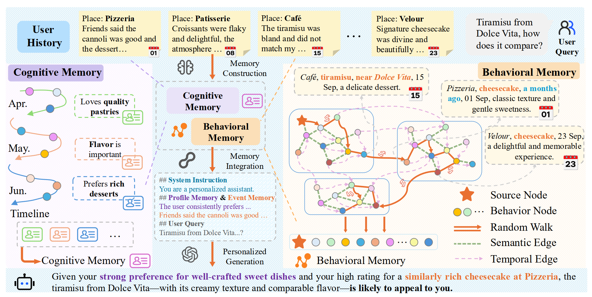
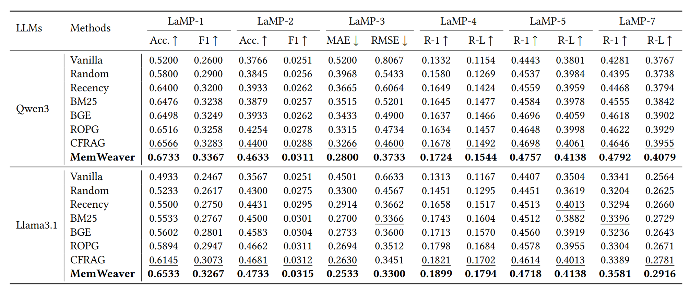
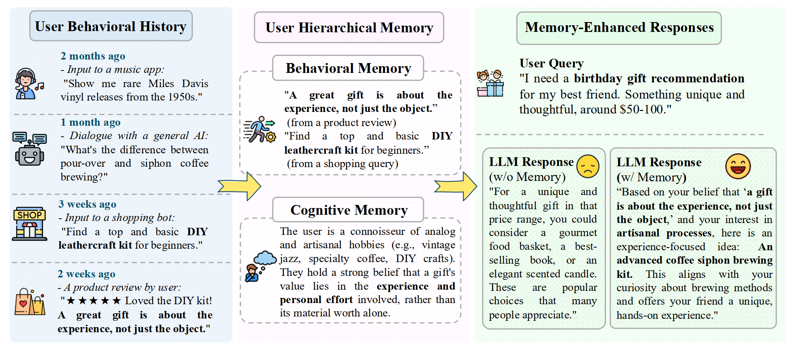

<div align="center">
  <h1>
        🕸️ MemWeaver: A Hierarchical Memory from  Textual Interactive Behaviors for Personalized Generation
  </h1> 
</div>

<div align="center">
<a href="https://arxiv.org/abs/2510.07713">
    📖 <strong>Paper</strong>
  </a> 
  <!-- | -->
    <!-- <a href="https://drive.google.com/drive/folders/19P---oV4nQ53JgKnE0VX3t_N1jLliVSv?usp=drive_link">
    📊 <strong>Datasets</strong>
  </a> | -->
  <!-- <a href="https://icml.cc/virtual/2025/poster/43701">
    📸 <strong>Poster</strong>
  </a> |
  <a href="https://icml.cc/virtual/2025/poster/43701">
    🌈 <strong>Slide</strong>
  </a> |
  <a href="https://recorder-v3.slideslive.com/#/share?share=101481&s=cb30d33d-2ae1-472d-ade2-81905c3da429"> 
    📽️ <strong>SlidesLive</strong> </a> -->
  <br><br>
  
  
  
  
</div>

---

## 📖 Abstract

MemWeaver is a framework that transforms a user’s entire textual interaction history into a hierarchical memory, enabling large MemWeaver is a framework that transforms a user’s textual interaction history into a hierarchical memory, enabling large language models (LLMs) to generate content that is deeply aligned with individual preferences.
Unlike prior personalization methods that treat user history as a flat list of texts, MemWeaver models both the temporal evolution and semantic relationships underlying user behaviors.

Through this design, MemWeaver captures not only what a user did, but also how their interests evolve and interconnect over time—laying the foundation for cognitively inspired personalization.

<details>
<summary><b>Full Abstract</b></summary>

The primary form of user-internet engagement is shifting from leveraging implicit feedback signals, such as browsing and clicks, to harnessing the rich explicit feedback provided by textual interactive behaviors. This shift unlocks a rich source of user textual history, presenting a profound opportunity for a deeper form of personalization. However, prevailing approaches offer only a shallow form of personalization, as they treat user history as a flat list of texts for retrieval and fail to model the rich temporal and semantic structures reflecting dynamic nature of user interests. In this work, we propose \textbf{MemWeaver}, a framework that weaves the user's entire textual history into a hierarchical memory to power deeply personalized generation. The core innovation of our memory lies in its ability to capture both the temporal evolution of interests and the semantic relationships between different activities.  To achieve this, MemWeaver builds two complementary memory components that both integrate temporal and semantic information, but at different levels of abstraction: behavioral memory, which captures specific user actions, and cognitive memory, which represents long-term preferences. This dual-component memory serves as a unified representation of the user, allowing large language models (LLMs) to reason over both concrete  behaviors and abstracted traits. Experiments on the Language Model Personalization (LaMP) benchmark validate the efficacy of MemWeaver. 

</details>

## 🎁 Updates/News:

<!-- 🚩 **Updates** (Jun. 2025): MemWeaver-v2 Expands Qwen2.5-0.5B as backbone network.

🎉 **News** (May. 2025): **MemWeaver has been accepted by ICML 2025**.

🚩 **Updates** (Jan. 2025): MemWeaver is being improved, refactored, and reviewed. -->

🚩 **News** (Oct. 2025): MemWeaver initialized.


## 🌟 Overview

<div align="center">

<p><em>Figure 1: Overview of the MemWeaver.</em></p>
</div>


**MemWeaver** weaves the user's entire textual history into two complementary memory components:

**Behavioral Memory** — captures concrete, context-specific user actions and short-term intent.

**Cognitive Memory** — abstracts long-term, stable user preferences and high-level tendencies.

Together, these components form a unified user representation that allows LLMs to reason across both immediate and enduring aspects of user behavior, achieving coherent and deeply personalized generation.
Experiments on the LaMP (Language Model Personalization) benchmark demonstrate that MemWeaver consistently outperforms existing retrieval and generation baselines.

## ⚙️ Key Features

✨ Key Features

🔄 Hierarchical Memory Design: Integrates behavioral and cognitive memories to jointly model short-term context and long-term preference.

⏳ Temporal–Semantic Fusion: Explicitly captures both time-dependent and meaning-based relationships among user behaviors.

🧩 Cognitive Abstraction: Mimics human-like summarization by progressively compressing textual history from detailed actions to abstract traits.

🧠 LLM-Augmented Personalization: Provides interpretable and controllable conditioning signals for large language models.

🧾 Empirical Validation: Achieves state-of-the-art performance on six tasks of the LaMP benchmark for personalized text generation.


## 🚀 Quick Start

### 1. Environment

We recommend using **Python 3.10+** and setting up a clean environment via `conda`:

```bash
conda create -n memweaver python==3.10
conda activate memweaver

cd <YOUR WORKING DIR>
git clone https://github.com/fishsure/MemWeaver.git

# Install from requirements
cd MemWeaver
pip install -r requirements.txt
```

### 2. Datasets and Models

#### Datasets

MemWeaver is evaluated on the **LaMP (Language Model Personalization) Benchmark**, which consists of seven diverse personalization tasks:

| Task | Type | Description | Metrics |
|------|------|-------------|---------|
| **LaMP-1** | Classification | Personalized citation identification | Accuracy |
| **LaMP-2** | Multi-label Classification | Personalized movie tagging | F1, Accuracy |
| **LaMP-3** | Regression | Personalized product rating | MAE, RMSE |
| **LaMP-4** | Generation | Personalized news headline generation | ROUGE-1, ROUGE-L |
| **LaMP-5** | Generation | Personalized scholarly title generation | ROUGE-1, ROUGE-L |
| ~~**LaMP-6**~~ | ~~Generation~~ | ~~Personalized email subject generation~~ | ~~Not available~~ |
| **LaMP-7** | Generation | Personalized tweet generation | ROUGE-1, ROUGE-L |

> **Note:** LaMP-6 is a private dataset and is not used in this evaluation.

**Download LaMP Dataset:**

```bash
cd MemWeaver
python data/download_LaMP.py
```

This will automatically download all LaMP datasets (LaMP-1 through LaMP-7) from the official source, including both regular and time-aware versions.

#### Models

MemWeaver supports multiple backbone models for retrieval and generation:

**Retrieval Models** (for behavioral memory construction):
- **BGE-M3**: `BAAI/bge-m3`
- **Qwen3-Embedding-0.6B**: `Qwen/Qwen3-Embedding-0.6B`

**Generation Models** (for personalized generation):
- **Qwen3-8B**: `Qwen/Qwen3-8B`
- **Llama-3.1-8B-Instruct**: `meta-llama/Llama-3.1-8B-Instruct`

**Download Models:**

You can download the models from Hugging Face:

```bash
# Install huggingface-hub if not already installed
pip install huggingface-hub

# Download retrieval models
huggingface-cli download BAAI/bge-m3 --local-dir models/bge-m3
huggingface-cli download Qwen/Qwen3-Embedding-0.6B --local-dir models/Qwen3-Embedding-0.6B

# Download generation models
huggingface-cli download Qwen/Qwen3-8B --local-dir models/Qwen3-8B
huggingface-cli download meta-llama/Llama-3.1-8B-Instruct --local-dir models/Llama-3.1-8B-Instruct
```

### 3. Evaluation

Run the full pipeline using the provided script:

#### Stage 1: Memory Construction & Retrieval

Or run each stage separately:

**Stage 1: Memory Construction**

```bash
python ranking.py \
    --task LaMP_1_time \
    --rank_stage mem_graph \
    --base_retriever_path models/bge-m3 \
    --llm_name models/Llama-3.1-8B-Instruct \
    --topk 5 \
    --use_graph_walk 1
```

**Stage 2: Personalized Generation**

```bash
python generate/generate.py \
    --task LaMP_1_time \
    --model_name models/Llama-3.1-8B-Instruct
```

**Evaluation Metrics:**
- **LaMP-1**: Accuracy
- **LaMP-2**: F1, Accuracy  
- **LaMP-3**: MAE, RMSE
- **LaMP-4 to LaMP-7**: ROUGE-1, ROUGE-L

## 💪 Performance

### 📈 Main Results




### 🗂️ Case Study



## 🙏 Acknowledgement

This repo is built on the pioneer works. We appreciate the following GitHub repos a lot for their valuable code base or datasets:

- [LaMP](https://github.com/LaMP-Benchmark/LaMP)

- [CFRAG](https://github.com/TengShi-RUC/CFRAG)


## 🔖 Citation

>🙋 Please let us know if you find out a mistake or have any suggestions!
>
>🌟 If you find our work helpful, please consider to star this repository and cite our research.

```bibtex
@misc{yu2025memweaverhierarchicalmemorytextual,
      title={MemWeaver: A Hierarchical Memory from Textual Interactive Behaviors for Personalized Generation}, 
      author={Shuo Yu and Mingyue Cheng and Daoyu Wang and Qi Liu and Zirui Liu and Ze Guo and Xiaoyu Tao},
      year={2025},
      eprint={2510.07713},
      archivePrefix={arXiv},
      primaryClass={cs.CL},
      url={https://arxiv.org/abs/2510.07713}, 
}
```